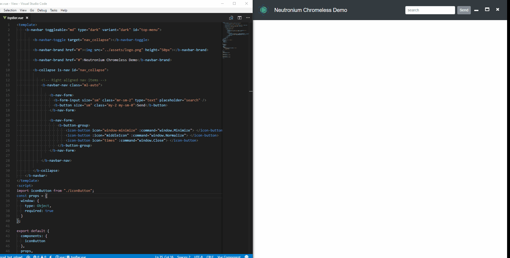
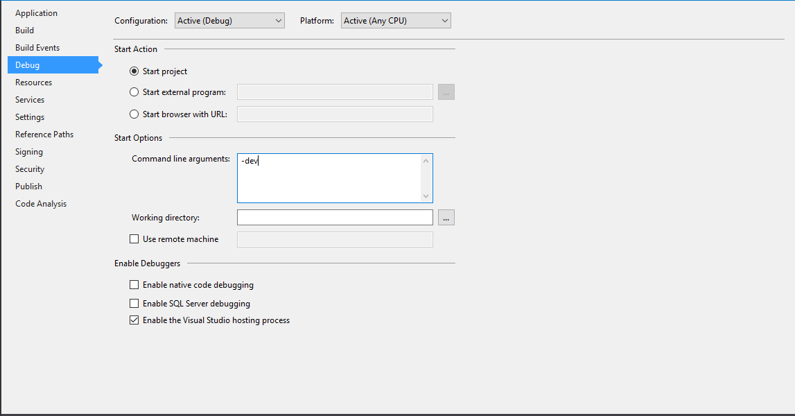

# Neutronium.Template

Visual Studio 2015-7 [Neutronium](https://github.com/NeutroniumCore/Neutronium) Template

https://marketplace.visualstudio.com/items?itemName=DavidDes.NeutroniumApplicationTemplates

## Included:
- `Neutronium knockout Application` Neutronium Knockout simple template
- `Neutronium Vue Application` Neutronium Vue simple template
- `Neutronium.Vue.SPA` Neutronium Vue SPA template

## Application mode and Hot-reload

Neutronium vue template are provided with [neutronium-vue](https://github.com/NeutroniumCore/neutronium-vue) vue webpack set-up. 
The following scripts are available:
- `npm run build` to build vue application to be loaded in Neutronium application
- `npm run dev` to run the vue application in the browser 
- `npm run integrated` to serve the vue application locally so that you use hot-reload in Neutronium application

The provided Neutronium application can be runt in 3 modes:
- `-dev` development mode with hot-reload enable. You should run `npm run integrated` before running the application in this mode
- `-test` test mode: Neutronium debug is allowed but files from the build are used. No hot-reload
- `-prod` production mode: no Neutronium debug allowed. Build files are used

`Production mode` is the only possible mode when using none-debug build. 
`Test mode` is the default mode when building in debug mode. 
To switch the different modes, use the Visual studio `Project Property>Debug` window: 

